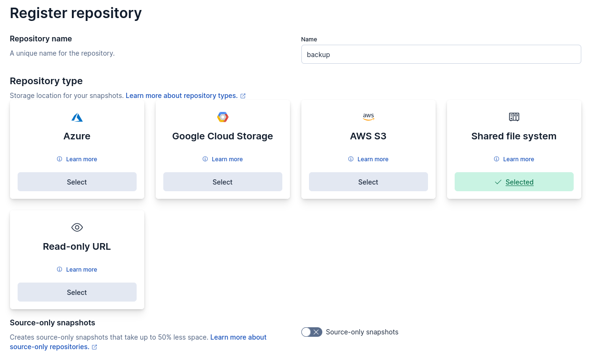
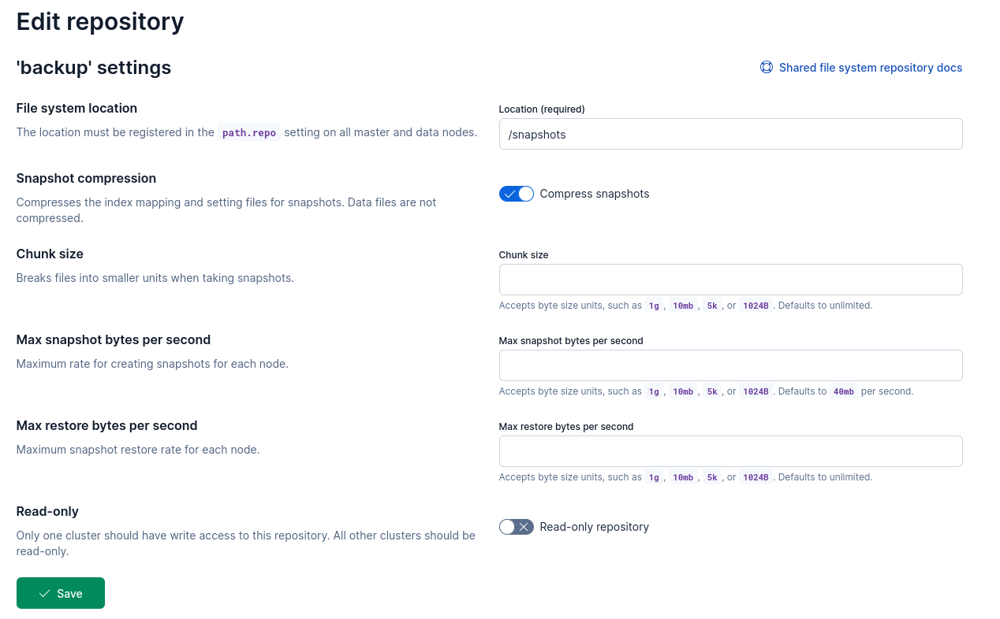
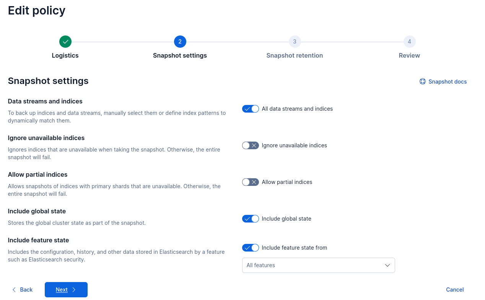
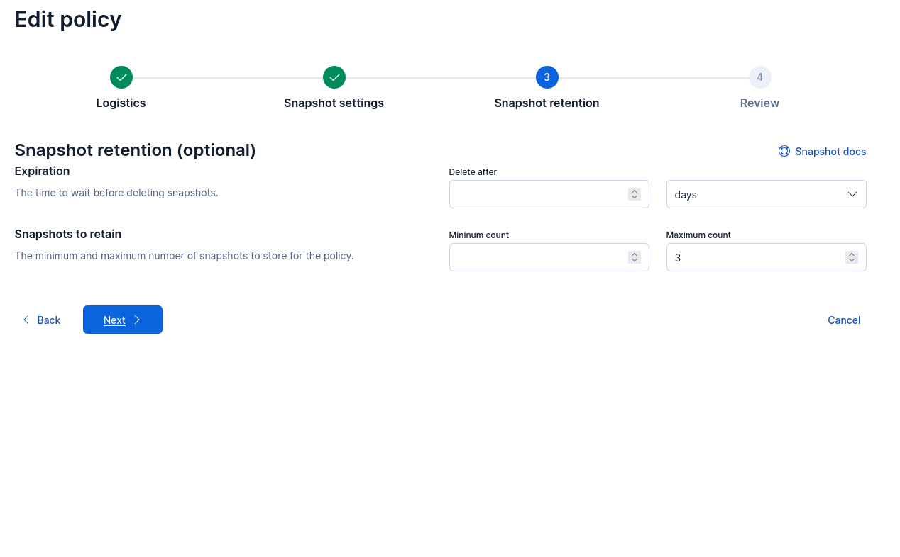

# ELK-STACK
Secure ELK stack (Elasticsearch, Logstash, Kibana) with HTTPS and authentication, fully automated using Docker.

## Features
- Elasticsearch 9.x
- HTTPS (TLS certificates auto-generated)
- Security enabled (elastic / kibana_system)
- Persistent data via Docker volumes
- Ready for snapshots & migration

## Setup - run once  
```bash
chmod +x setup-elk.sh
./setup-elk.sh
```
## Normal starting process  
```bash
docker compose up -d
```

## Reconstruction without changing the .env    
```bash
chmod +x repush_password.sh
./repush_password.sh
```

## Architecture    
```bash
├── certs/ # Certificats TLS (CA + instance)
│ ├── ca/
│ └── instance/
├── logstash/
│ └── pipeline/
│ └── logstash.conf
├── docker-compose.yml
├── Dockerfiles/
│ ├── Dockerfile.elasticsearch
│ ├── Dockerfile.kibana
│ └── Dockerfile.logstash
├── .env # Secrets non present but created
├── setup-elk.sh
└── README.md
```

## Snapshots and Restore 
### Snapshot creation  
In `Management` > `Stack Management` > `Snapshot and Restore`  
#### Register repository  
<p align="center">
  
</p>   

#### Backup Settings   
<p align="center">
  
</p>  

#### Policy Configuration
<p align="center">
  
</p>  

<p align="center">
  
</p>  

<p align="center">
  
</p>  

> [!TIP]
> **Folder of Snapshots**  
> After configuring snapshots correctly, you can verify the repositories and check the repository status to ensure that your configuration is correct.  
> Once validated, you can manually run the snapshot command for the first time to verify that the snapshot is successfully created in the `/var/backups/elasticsearch` directory on the host, in accordance with the volume mapping defined in your [docker-compose.yml](https://github.com/Oni-kuki/ELK-STACK/blob/9d708a497b7f27287240507c25acb9ae30d2bf10/docker-compose.yml#L25) configuration.
